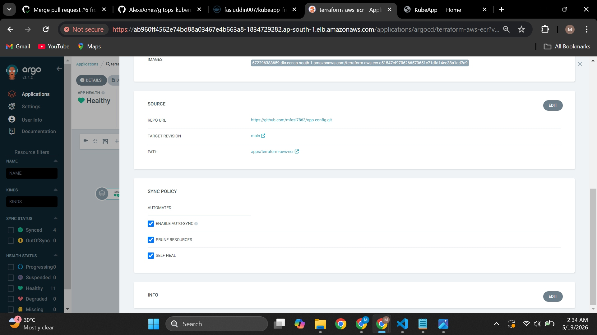
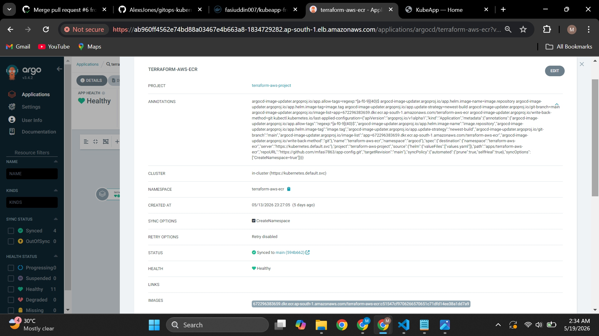
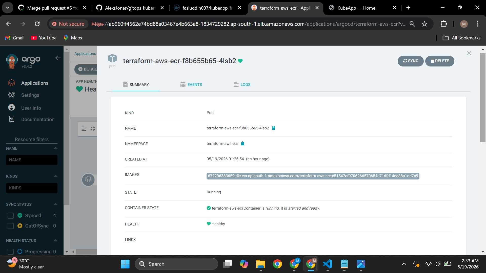
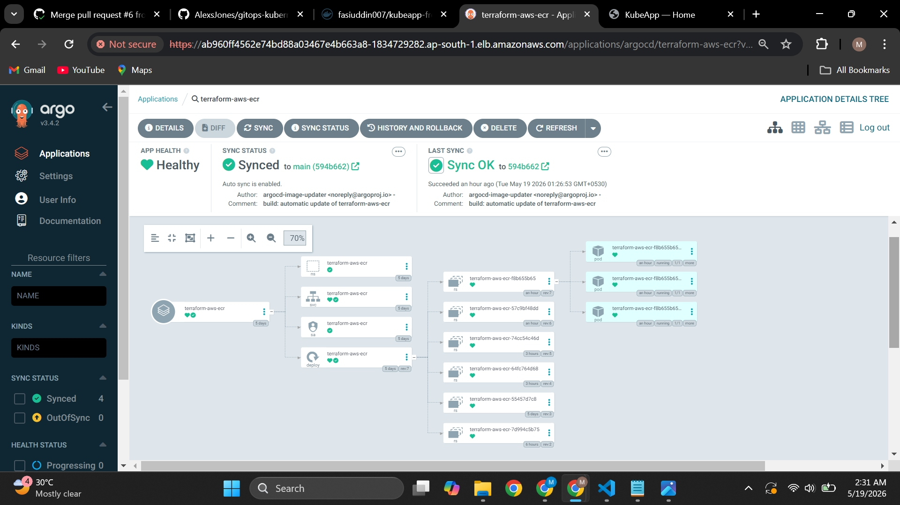
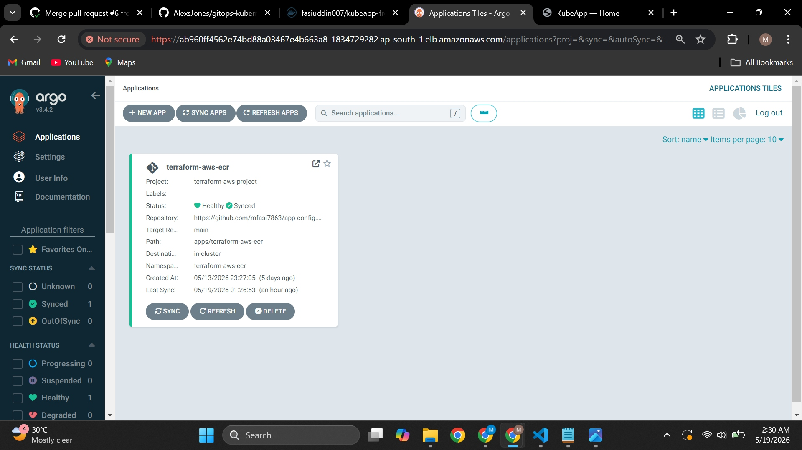

# app-config

> GitOps delivery for my Kubernetes application using GitHub Actions, Amazon ECR, Argo CD Image Updater, and Amazon EKS.


This repository is the GitOps layer of the project.
The application source code lives in a separate **K8s** repository, while this repo is responsible for telling Argo CD what should run inside the cluster.

The main idea behind this setup is simple: application code changes happen in one repository, deployment state changes happen in another repository, and Argo CD keeps the cluster aligned with Git.

---

## Why this repo exists

I wanted to build a deployment flow where I do not manually change image tags inside Kubernetes manifests every time the application changes.

Instead of rebuilding and updating everything by hand, this repository works as the GitOps bridge between:

- the application source repository (`K8s`)
- Amazon ECR
- Argo CD Image Updater
- the `app-config` GitOps repository
- the EKS cluster

That means this repo is not just a place to store YAML files. It is the deployment source of truth for what should finally run on Kubernetes.

---

## End-to-end flow

```text
Code change in K8s repo
        ↓
GitHub Actions workflow runs
        ↓
Docker image is built and pushed to Amazon ECR
        ↓
Image is tagged with latest GitHub SHA
        ↓
Argo CD Image Updater detects the new image tag in ECR
        ↓
Image Updater writes the new tag back to this app-config repo
        ↓
Argo CD detects the Git change in app-config
        ↓
Argo CD syncs the updated manifests to EKS
        ↓
EKS pulls the new image from ECR and deploys the new version
```

This is the part I wanted this project to highlight the most: the deployment happens through GitOps, but the image version is still updated automatically through Argo CD Image Updater.

---

## Repository structure

```text
.
├── README.md
├── apps
│   └── terraform-aws-ecr
│       ├── Chart.yaml
│       ├── templates
│       │   ├── deployment.yaml
│       │   ├── namespace.yaml
│       │   ├── service.yaml
│       │   └── serviceaccount.yaml
│       └── values.yaml
└── argocd
    ├── app-config-repo-creds.yaml
    ├── image-updater.yaml
    ├── project.yaml
    └── terraform-aws-ecr-app.yaml
```

### Main folders

- `apps/terraform-aws-ecr` contains the Helm chart used by Argo CD.
- `templates/deployment.yaml` defines how the application pods are deployed.
- `templates/namespace.yaml` creates the target namespace.
- `argocd/project.yaml` defines the project boundary.
- `argocd/terraform-aws-ecr-app.yaml` defines the Argo CD application and image updater annotations.
- `argocd/image-updater.yaml` contains the Image Updater configuration.
- `argocd/app-config-repo-creds.yaml` is used so Argo CD components can work with the Git repository securely.

---

## Argo CD application setup

The application points to this repository and deploys the Helm chart from `apps/terraform-aws-ecr` into the `terraform-aws-ecr` namespace.

It is also configured with automated sync options:

- Auto-sync enabled
- Prune enabled
- Self-heal enabled
- CreateNamespace enabled

That means once the GitOps repository changes, the cluster updates itself without requiring a manual sync step in normal operation.

---

## Screenshots

### Argo CD application tile

This shows the application registered in Argo CD and confirms that the app is both **Healthy** and **Synced**.



### Argo CD resource tree

The resource tree view shows Argo CD tracking the deployment, service account, service, replica sets, and running pods.


### Synced application details

This view confirms that the application is synced to the latest commit in the `app-config` repository and that Image Updater is participating in the commit history.



### Image tag in running pod

This screenshot is useful because it shows the running pod using the ECR image with the Git-based SHA tag, which is the core idea behind this flow.



### Application endpoint

This is the deployed application exposed through the Kubernetes `LoadBalancer` service.



### Sync policy and source configuration

This confirms that the app is pulling from the correct repo path and that automated sync, prune, and self-heal are enabled.



---

## Current deployment state

Based on the latest cluster status:

### Argo CD namespace

- Most core Argo CD components are running.
- `argocd-server`, `repo-server`, `application-controller`, `notifications-controller`, `redis`, and `image-updater-controller` are healthy.
- `argocd-applicationset-controller` is currently in `CrashLoopBackOff` and still needs separate troubleshooting.

### Application namespace

The `terraform-aws-ecr` application is currently deployed in its own namespace with:

- 3 running pods
- 1 `LoadBalancer` service
- 1 healthy deployment
- External access exposed through an AWS ELB

---

## Why I built it this way

A lot of beginner GitOps setups stop at Argo CD syncing static manifests.

In this project, I wanted to go a step further and connect the full path from application source code to container registry to GitOps repo to running workload on EKS.

That gave me hands-on practice with:

- separating app code from deployment configuration
- using Amazon ECR as the internal image registry
- using GitHub Actions to produce immutable image tags
- using Argo CD Image Updater to avoid manual image tag edits
- using Argo CD automated sync to deploy the updated version to EKS

---

## Useful commands

```bash
kubectl get all -n argocd
kubectl get all -n terraform-aws-ecr
kubectl describe application terraform-aws-ecr -n argocd
kubectl logs -n argocd deploy/argocd-image-updater-controller
kubectl logs -n argocd deploy/argocd-repo-server
```

These are the commands I used most often while checking whether the image update and sync flow was working correctly.

---

## Next improvements

There are still a few things I would improve in the next version of this setup:

- fix the `argocd-applicationset-controller` crash loop
- pin image update strategy more tightly if needed
- add richer health probes and resource limits
- add CI/CD screenshots from the `K8s` repository workflow
- document rollback flow from Argo CD history

---

## Final note

For me, the most important part of this project is not just that the app runs on Kubernetes.

It is that a code change in one repository can automatically move all the way through image build, registry push, manifest update, GitOps sync, and EKS deployment with minimal manual intervention.
